<div align="center">

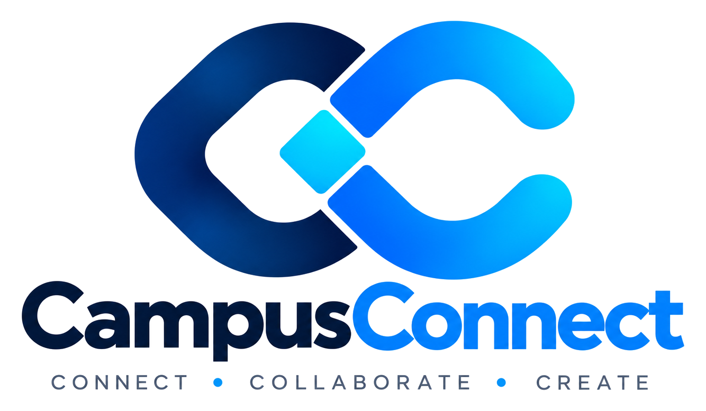

### Connect. Collaborate. Grow.

A full-stack student community platform for discovering peers, building networks, collaborating on projects, joining campus communities, communicating in real time, and engaging through events and posts.

<br>

<a href="https://campus-connect-omega-seven.vercel.app/"><strong>Live Demo</strong></a>
&nbsp; · &nbsp;
<a href="https://github.com/Ashu-3180/CampusConnect"><strong>GitHub Repository</strong></a>
&nbsp; · &nbsp;
<a href="https://campusconnect-api-b6x6.onrender.com/"><strong>API</strong></a>

<br><br>


</div>

---

# 1. CampusConnect

CampusConnect is a full-stack student community platform built to create a focused digital space for students to **discover peers, build connections, share ideas, collaborate on projects, join clubs, participate in events, and communicate in real time**.

It combines a React/Vite frontend with a Node.js/Express backend, MongoDB/Mongoose persistence, Socket.IO real-time communication, and MongoDB GridFS-backed media storage.

### Project at a Glance

| | |
|---|---|
| **Application type** | Full-stack student community platform |
| **Frontend** | React 19 + Vite 8 + Tailwind CSS 4 |
| **Backend** | Node.js + Express 5 |
| **Database** | MongoDB + Mongoose 9 |
| **Real-time** | Socket.IO 4 |
| **Media** | MongoDB GridFS + Sharp |
| **REST endpoints** | 45 across 10 route modules |
| **MongoDB models** | 7 |
| **Application pages** | 19 |
| **Release** | `v1.0.0` |
| **License** | GNU AGPLv3-only |
| **Copyright** | Asif Ahamad |

---

# 2. Project Overview

CampusConnect brings common student interactions into one connected platform.

Instead of relying on separate tools for profiles, student networking, project teams, event discovery, community discussions, and messaging, CampusConnect links these workflows through a shared student identity and network.

### Core Platform Areas

- Student profiles and discovery
- Networking and connection requests
- Campus feed and posts
- Project collaboration opportunities
- Events and campus activities
- Clubs and communities
- Real-time one-to-one messaging
- Notifications
- Privacy, security, language, and appearance settings

### Why CampusConnect?

The platform is intentionally designed around **student-to-student discovery and collaboration** rather than being a generic social network.

A student can move through a typical journey such as:

```text
Discover a student
      ↓
View profile
      ↓
Send connection request
      ↓
Become connected
      ↓
Start a conversation
      ↓
Join or create a collaboration
      ↓
Participate in events / clubs
      ↓
Share progress in the campus feed
```

---

# 3. Problem Statement

Students often need multiple disconnected channels to:

- Find peers with complementary skills
- Build project teams
- Ask questions and share achievements
- Discover events and student communities
- Maintain a profile that communicates academic and technical interests
- Network with other students
- Communicate with project collaborators

These interactions can become fragmented across messaging applications, social platforms, event groups, spreadsheets, and informal campus communities.

The result is a disconnected experience where **finding the right person, opportunity, or community often depends on already being part of the right group**.

CampusConnect addresses this problem by providing a common platform where identity, discovery, networking, collaboration, events, communities, content, and messaging work together.

---

# 4. Solution

CampusConnect is organized around four core experiences:

### Discover

Search and discover students using profile information, university, course, and skills. Discover posts, collaborations, events, and clubs through dedicated platform areas.

### Connect

Build a student network through connection requests and accepted connections. Connections become the basis for trusted peer-to-peer communication.

### Collaborate

Create project opportunities, define required skills and member capacity, receive applications, and manage collaboration membership.

### Communicate

Share community posts, comments, notifications, and direct messages while keeping messaging access tied to existing connections.

---

# 5. Key Features

## 🔐 Authentication & Account Management

- Registration and login
- JWT-based authentication
- Protected application routes
- Current-user retrieval
- Password change
- Account deletion
- Session-expiry handling

## 👤 Student Profiles

- Personal student profile
- University and course information
- Graduation year
- Biography
- Skills
- GitHub and LinkedIn profiles
- Profile image
- Profile visibility
- Public student profile viewing
- Profile-specific posts

## 🔎 Discovery & Search

- Student discovery
- Search by name, university, course, or skills
- Post search
- Collaboration search
- Club search/filtering
- Dedicated search experience

## 🤝 Networking

- Send connection requests
- Cancel sent requests
- Accept or reject requests
- View connections
- Connection-aware messaging

## 📝 Campus Feed & Posts

- Create posts
- Edit posts
- Delete posts
- Post categories
- Image/video attachments
- Likes
- Comments
- Comment deletion
- Post detail pages
- Post search

### Post Categories

- General
- Question
- Project
- Achievement
- Announcement

## 🚀 Collaboration

- Create collaboration opportunities
- Search and filter projects
- Required skills
- Member capacity
- Collaboration applications
- Application messages
- Accept/reject applications
- Collaboration closure
- Member management

## 📅 Events

- Create events
- Browse upcoming events
- Search events
- Filter by category
- View event details
- Join events
- Leave events
- Personal event participation
- Event capacity
- Event ownership controls

## 🏫 Clubs & Communities

- Browse clubs
- Search clubs
- View club details
- Join clubs
- Leave clubs
- Create clubs
- Club membership management

## 💬 Real-Time Messaging

- Connection-based one-to-one messaging
- Conversation list
- Persistent message history
- Real-time message delivery
- Online-user presence
- Typing indicators
- Unread counts
- Read state
- Real-time read notifications

## 🔔 Notifications

- Connection notifications
- Post-like notifications
- Post-comment notifications
- Collaboration application notifications
- Collaboration acceptance notifications
- Event notifications
- Read/unread state
- Mark one notification as read
- Mark all notifications as read
- Notification preferences

## ⚙️ Settings & Personalization

- Dark mode
- Profile visibility controls
- Email notification preferences
- Event notifications
- Collaboration notifications
- English / Hindi language selection
- Password/security settings
- Account deletion
- Help and About panels

## 🎨 Responsive UI & Branding

- Responsive application shell
- Light and dark themes
- Dynamic authenticated-app background
- Reduced-motion support
- Custom CampusConnect brand system
- Logo, mark, wordmark, monochrome, dark, and favicon variants

---

# 6. Product Screenshots

The following screenshots are from the final application UI and are included in `docs/screenshots/`.

<table>
<tr>
<td width="50%" align="center">

### Landing / Registration

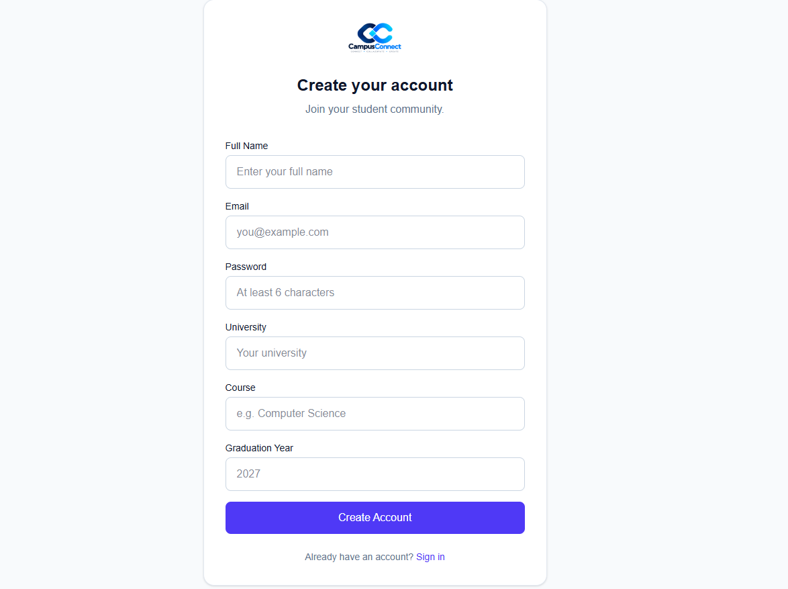

</td>
<td width="50%" align="center">

### Campus Feed

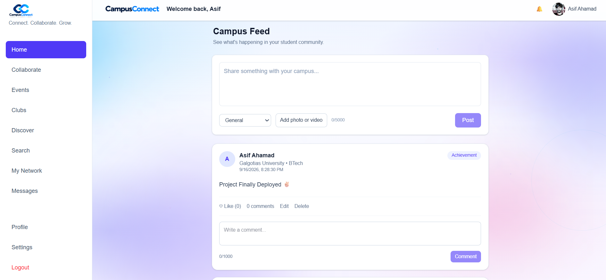

</td>
</tr>

<tr>
<td width="50%" align="center">

### Discover Students

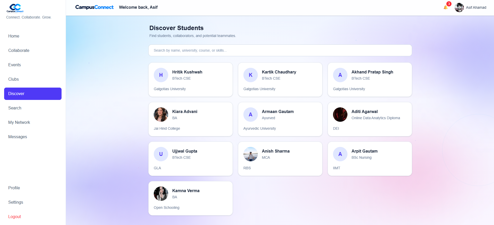

</td>
<td width="50%" align="center">

### My Network

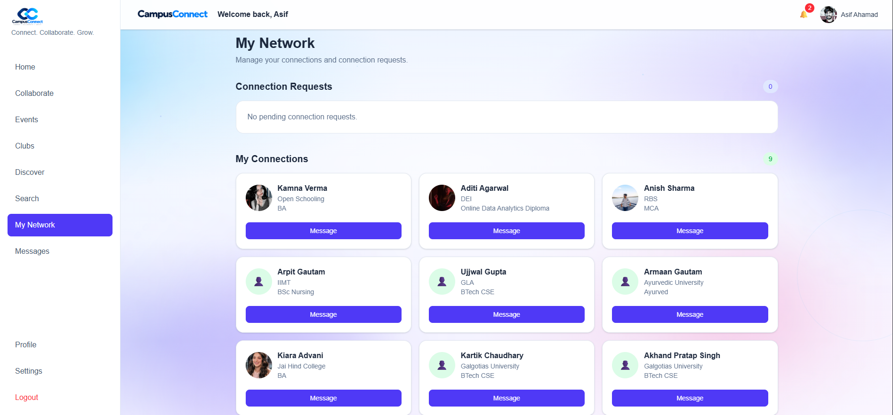

</td>
</tr>

<tr>
<td width="50%" align="center">

### Collaborations

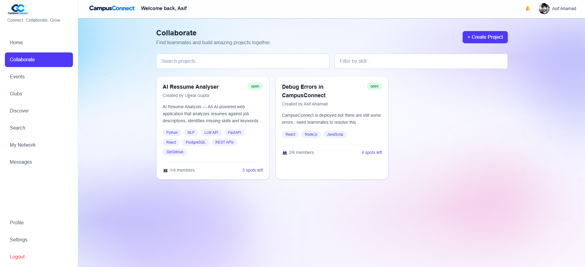

</td>
<td width="50%" align="center">

### Events

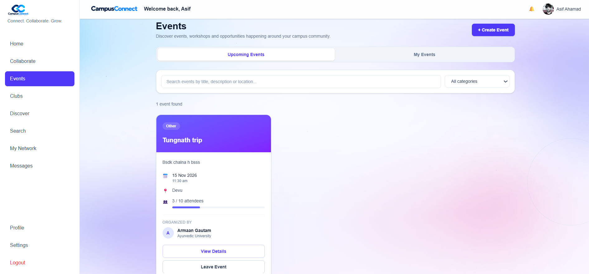

</td>
</tr>

<tr>
<td width="50%" align="center">

### Messaging

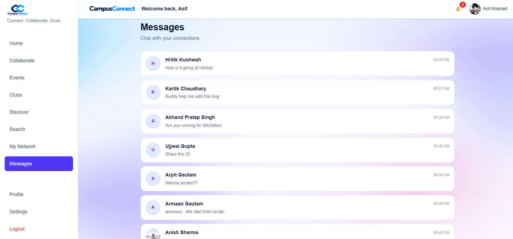

</td>
<td width="50%" align="center">

### Profile

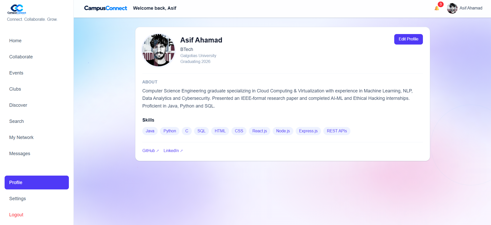

</td>
</tr>

<tr>
<td width="50%" align="center">

### Settings

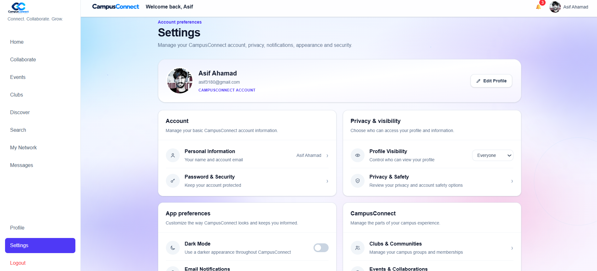

</td>
<td width="50%" align="center">

### Search

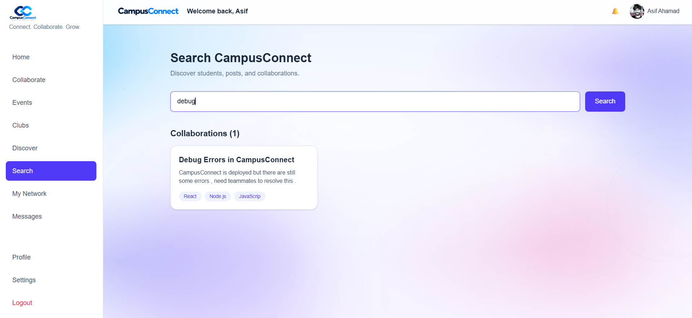

</td>
</tr>
</table>

---

# 7. System Architecture

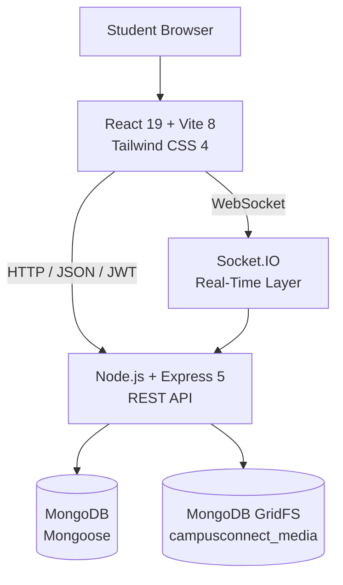

### Request Flow

```text
Browser
  │
  ├── REST API ────────────────► Express
  │                               │
  │                               ├── Authentication
  │                               ├── Authorization
  │                               ├── Business Logic
  │                               ├── Validation
  │                               └── Persistence
  │                                       │
  │                                       └── MongoDB / GridFS
  │
  └── Socket.IO ───────────────► Real-Time Events
```

---

# 8. Application Architecture

## Frontend Architecture

```text
client/
├── src/
│   ├── assets/
│   ├── components/
│   │   ├── collaborations/
│   │   ├── common/
│   │   ├── layout/
│   │   ├── notifications/
│   │   ├── posts/
│   │   └── settings/
│   ├── context/
│   ├── i18n/
│   ├── pages/
│   ├── services/
│   ├── socket/
│   ├── App.jsx
│   └── main.jsx
│
└── public/
    └── branding/
```

### Frontend responsibilities

- Route-level page rendering
- Shared UI components
- Authentication state
- API communication
- Socket.IO client state/events
- Application settings
- Internationalization
- Responsive UI and theme handling

## Backend Architecture

```text
server/
├── src/
│   ├── config/
│   ├── controllers/
│   ├── middleware/
│   ├── models/
│   ├── routes/
│   ├── services/
│   └── utils/
│
└── server.js
```

### Backend responsibilities

- REST API endpoints
- Authentication and authorization
- Business rules
- Database operations
- Notifications
- Media processing
- GridFS storage/retrieval
- Socket.IO event handling
- Error handling

### Current backend modules

- 10 route modules
- 10 controllers
- 7 Mongoose models
- 3 middleware modules
- 1 media service module

---

# 9. Tech Stack

## Frontend

| Technology | Purpose |
|---|---|
| React 19 | User interface |
| Vite 8 | Development and production build |
| React Router 7 | Client-side routing |
| Tailwind CSS 4 | Styling |
| Socket.IO Client 4 | Real-time communication |
| React Toastify 11 | User feedback |
| Oxlint | Frontend linting |

## Backend

| Technology | Purpose |
|---|---|
| Node.js | Server runtime |
| Express 5 | REST API framework |
| Mongoose 9 | MongoDB ODM |
| MongoDB Node.js Driver 7 | MongoDB/GridFS integration |
| JSON Web Token | Authentication |
| bcryptjs | Password hashing |
| Socket.IO 4 | Real-time server |
| Multer | Multipart upload handling |
| Sharp | Image processing |
| CORS | Cross-origin configuration |
| dotenv | Environment configuration |
| Nodemon | Development server |

## Infrastructure

- MongoDB / MongoDB Atlas
- Vercel
- Render
- Git
- GitHub

---

# 10. Project Structure

```text
CampusConnect/
│
├── client/
│   ├── public/
│   │   └── branding/
│   │       ├── campusconnect-logo.svg
│   │       ├── campusconnect-logo-dark.svg
│   │       ├── campusconnect-mark.svg
│   │       ├── campusconnect-mark-dark.svg
│   │       ├── campusconnect-monochrome.svg
│   │       ├── campusconnect-monochrome-dark.svg
│   │       ├── campusconnect-wordmark.svg
│   │       ├── campusconnect-wordmark-dark.svg
│   │       └── favicon.svg
│   │
│   └── src/
│       ├── assets/
│       ├── components/
│       ├── context/
│       ├── i18n/
│       ├── pages/
│       ├── services/
│       └── socket/
│
├── server/
│   └── src/
│       ├── config/
│       ├── controllers/
│       ├── middleware/
│       ├── models/
│       ├── routes/
│       ├── services/
│       └── utils/
│
├── .gitignore
├── BRANDING.md
├── COPYRIGHT.md
├── FINAL-RELEASE-CHECKLIST.md
├── LICENSE
├── THIRD-PARTY-NOTICES.md
├── package.json
└── README.md
```

Runtime/user-uploaded files are intentionally excluded from version control.

---

# 11. Core Data Models

CampusConnect uses seven primary Mongoose models.

| Model | Responsibility |
|---|---|
| `User` | Identity, academic profile, skills, preferences, privacy, connections |
| `Post` | Feed content, categories, likes, comments, media references |
| `Collaboration` | Project opportunities, skills, applications, members, status |
| `Event` | Event information, organizer, attendees, category, capacity |
| `Message` | Direct messages, sender/receiver relationships, read state |
| `Notification` | User notifications, type, target, read state |
| `Club` | Student communities, category, creator, membership |

### Relationship overview

```text
User
 ├── creates ───────► Posts
 ├── connects with ─► Users
 ├── owns ──────────► Collaborations
 ├── joins ─────────► Collaborations
 ├── creates/joins ─► Events
 ├── creates/joins ─► Clubs
 ├── sends/receives ► Messages
 └── receives ──────► Notifications
```

---

# 12. API Overview

The backend currently exposes **45 REST endpoints across 10 route modules**.

| Module | Base path | Endpoints |
|---|---|---:|
| Authentication | `/api/auth` | 5 |
| Users | `/api/users` | 7 |
| Posts | `/api/posts` | 9 |
| Collaborations | `/api/collaborations` | 7 |
| Events | `/api/events` | 7 |
| Connections | `/api/connections` | 6 |
| Messages | `/api/messages` | 3 |
| Notifications | `/api/notifications` | 3 |
| Clubs | `/api/clubs` | 4 |
| Media | `/api/media` | 1 |
| **Total** | | **45** |

### Representative endpoints

```text
POST   /api/auth/register
POST   /api/auth/login
GET    /api/auth/me
PUT    /api/auth/change-password
DELETE /api/auth/delete-account

GET    /api/users
GET    /api/users/me
PUT    /api/users/me
POST   /api/users/me/profile-image

GET    /api/posts
POST   /api/posts
GET    /api/posts/search
GET    /api/posts/:id
POST   /api/posts/:id/like
POST   /api/posts/:id/comments
DELETE /api/posts/:id
DELETE /api/posts/:id/comments/:commentId

GET    /api/collaborations
POST   /api/collaborations
GET    /api/collaborations/search
POST   /api/collaborations/:id/apply
PUT    /api/collaborations/:id/applications/:applicationId
PUT    /api/collaborations/:id/close

GET    /api/events
POST   /api/events
GET    /api/events/my
GET    /api/events/:id
POST   /api/events/:id/join
DELETE /api/events/:id/leave

GET    /api/connections
GET    /api/connections/requests/received
POST   /api/connections/request/:userId
DELETE /api/connections/request/:userId
PUT    /api/connections/request/:userId/accept
PUT    /api/connections/request/:userId/reject

GET    /api/messages
GET    /api/messages/:userId
POST   /api/messages

GET    /api/notifications
PUT    /api/notifications/read-all
PUT    /api/notifications/:id/read

GET    /api/clubs/my
GET    /api/clubs/:id
POST   /api/clubs/:id/join
DELETE /api/clubs/:id/leave

GET    /api/media/:fileId
```

The route files under `server/src/routes/` remain the authoritative source for the API contract.

---

# 13. Real-Time Messaging Architecture

CampusConnect combines REST APIs for persistence with Socket.IO for real-time communication.

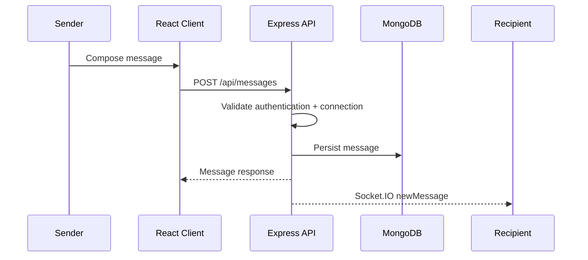

### Real-time events

```text
onlineUsers
newMessage
typing
stopTyping
messagesRead
```

### Presence model

The server maintains a user-to-socket mapping so that multiple active sockets can be associated with a single user.

### Messaging authorization

Messaging is intentionally connection-aware.

Before a message is stored, the backend verifies that the sender and recipient are connected. Conversation retrieval applies the same rule.

### Read state

Opening a conversation marks received unread messages as read and emits a `messagesRead` event to relevant connected sockets.

---

# 14. Authentication & Security

## Authentication

- JWT bearer authentication
- Protected frontend routes
- Protected backend endpoints
- Password hashing with bcryptjs
- Authenticated current-user retrieval
- Token-expiry handling

## Authorization

- Connection-aware messaging
- User/profile visibility controls
- Resource ownership checks
- Protected account operations
- Protected collaboration and event workflows

## Validation and request handling

- Request validation in controller/business logic
- Centralized 404 handling
- Centralized error middleware
- Consistent API error responses

## Upload security

- Multipart upload handling through Multer
- Allowed image/media types
- File-size limits
- Image processing through Sharp
- Media storage separated from normal application documents

## Configuration

Sensitive configuration is kept in environment variables and excluded from Git through `.gitignore`.

---

# 15. Media & Storage

CampusConnect uses MongoDB GridFS for application media.

```text
Browser Upload
      ↓
Multer
      ↓
Validation / Processing
      ↓
GridFS
      ↓
MongoDB
      ↓
Media API
      ↓
Browser
```

### GridFS bucket

```text
campusconnect_media
```

### Media service

The backend media service supports:

- Media upload
- Media metadata retrieval
- Streaming/download
- Media deletion
- ObjectId validation

### Image handling

Sharp is used where image processing is required before persistence.

### Video delivery

The media controller supports HTTP byte-range requests for video files, allowing browser seeking without requiring the entire video to be transferred at once.

Runtime filesystem uploads are excluded from source control.

---

# 16. UI/UX & Branding

CampusConnect has a dedicated visual identity rather than relying on default Vite/React branding.

## Brand Assets

```text
client/public/branding/
├── campusconnect-logo.svg
├── campusconnect-logo-dark.svg
├── campusconnect-mark.svg
├── campusconnect-mark-dark.svg
├── campusconnect-monochrome.svg
├── campusconnect-monochrome-dark.svg
├── campusconnect-wordmark.svg
├── campusconnect-wordmark-dark.svg
└── favicon.svg
```

## Brand Palette

Defined in `BRANDING.md`:

| Color | Hex |
|---|---|
| Deep Navy | `#0A2540` |
| Blue | `#2563EB` |
| Cyan | `#06B6D4` |

## UX characteristics

- Responsive layouts
- Light/dark theme
- Dynamic authenticated-app background
- Reduced-motion support
- Toast feedback
- Loading, empty, and error states
- English/Hindi localization
- Dedicated public and protected application experiences

---

# 17. Installation

## Prerequisites

- Node.js
- npm
- MongoDB or MongoDB Atlas
- Git

## Clone

```bash
git clone https://github.com/Ashu-3180/CampusConnect.git
cd CampusConnect
```

## Backend

```bash
cd server
npm install
```

Create:

```text
server/.env
```

Example:

```env
PORT=5000
MONGO_URI=your_mongodb_connection_string
JWT_SECRET=your_secure_jwt_secret
CLIENT_URL=http://localhost:5173
SERVER_URL=http://localhost:5000
```

Start:

```bash
npm run dev
```

Production-style start:

```bash
npm start
```

## Frontend

Open a second terminal:

```bash
cd client
npm install
```

Create:

```text
client/.env
```

Example:

```env
VITE_API_URL=http://localhost:5000/api
VITE_SOCKET_URL=http://localhost:5000
```

Start:

```bash
npm run dev
```

The frontend development server will normally be available at:

```text
http://localhost:5173
```

---

# 18. Environment Variables

## Backend

| Variable | Purpose | Required |
|---|---|---|
| `PORT` | Backend HTTP port | No |
| `MONGO_URI` | MongoDB connection string | Yes |
| `JWT_SECRET` | JWT signing secret | Yes |
| `CLIENT_URL` | Allowed frontend origin | Recommended |
| `SERVER_URL` | Public backend origin | Recommended |

## Frontend

| Variable | Purpose | Required |
|---|---|---|
| `VITE_API_URL` | REST API base URL | No |
| `VITE_SOCKET_URL` | Socket.IO server URL | No |

### Security rule

Never commit:

```text
.env
.env.*
```

Only example configuration files should be committed.

---

# 19. Testing

The final application was manually tested across the implemented feature set, and the current build was verified as functioning as expected.

### Tested areas

- Registration and login
- Authentication/session handling
- Profiles
- Student discovery
- Search
- Connections
- Posts
- Comments and likes
- Collaborations
- Events
- Clubs
- Real-time messaging
- Notifications
- Settings
- Dark mode
- English/Hindi localization
- Media handling
- Production deployment

### Frontend quality commands

Lint:

```bash
cd client
npm run lint
```

Production build:

```bash
npm run build
```

The application uses Oxlint for frontend code-quality checks.

---

# 20. Deployment

## Live Application

**Frontend / Live Demo**

https://campus-connect-omega-seven.vercel.app/

**Backend API**

https://campusconnect-api-b6x6.onrender.com/

**API health check**

https://campusconnect-api-b6x6.onrender.com/health

## Frontend — Vercel

The React/Vite frontend is deployed on Vercel.

SPA routing is configured through `client/vercel.json` so direct navigation to client-side routes resolves back to the application entry point.

Production frontend configuration:

```env
VITE_API_URL=<production-api>/api
VITE_SOCKET_URL=<production-api>
```

## Backend — Render

The Node.js/Express API is deployed on Render.

Production configuration includes:

```env
PORT=<platform-port>
MONGO_URI=<production-mongodb-uri>
JWT_SECRET=<production-secret>
CLIENT_URL=<production-frontend-url>
SERVER_URL=<production-backend-url>
```

## Database

MongoDB provides the application datastore, with GridFS used for media storage.

---

# 21. Technical Challenges & Solutions

## 1. Real-Time Messaging

**Challenge:** Messages needed persistence while still appearing immediately for connected recipients.

**Solution:** Messages are persisted through the REST API and delivered through Socket.IO events to connected recipients.

---

## 2. Connection-Based Messaging

**Challenge:** Messaging should not be available to every registered user.

**Solution:** The backend verifies the connection relationship before allowing conversations to be retrieved or messages to be created.

---

## 3. Production Media URLs

**Challenge:** Local development URLs such as `localhost` are not valid in production.

**Solution:** Profile/media URL normalization uses the request/server environment so media references remain valid after deployment.

---

## 4. Video Seeking

**Challenge:** Serving complete video files for every request is inefficient and prevents normal seeking behavior.

**Solution:** The media controller supports HTTP `Range` requests and streams only the requested byte range.

---

## 5. Session Expiration

**Challenge:** An expired JWT can leave a client in an inconsistent authenticated state.

**Solution:** Authentication failures are normalized through the API layer and surfaced as a centralized session-expiry condition.

---

## 6. SPA Route Handling in Production

**Challenge:** Direct browser navigation to nested client routes can produce server-side 404s in a single-page application.

**Solution:** Vercel rewrite configuration maps application routes back to the React entry point.

---

## 7. Repository Hygiene Before Open-Sourcing

**Challenge:** Runtime uploads, temporary patch scripts, and template assets had previously existed in the Git history.

**Solution:** The final release removes those artifacts from the current tree and rewrites the Git history before publishing the AGPLv3 release.

---

# 22. Engineering Decisions

### Modular Backend

The backend separates:

```text
Routes
→ Controllers
→ Services
→ Models
→ Database
```

This makes feature boundaries clearer and reduces coupling between HTTP routing and persistence logic.

### Centralized API Layer

The frontend uses a shared API layer to normalize:

- Authentication failures
- JSON responses
- API errors
- Media URLs
- Cache behavior

### Connection-Aware Communication

The network model is also used as an authorization boundary for private messaging.

### MongoDB GridFS

Media is treated separately from normal application entities so large binary content does not need to be embedded directly in ordinary documents.

### Protected Route Architecture

Public authentication pages and authenticated application pages use separate access boundaries.

### Internationalization

English and Hindi translations are managed through dedicated localization resources rather than duplicating text throughout the page components.

### Accessibility-Aware Animation

The dynamic background respects reduced-motion preferences to avoid forcing animation on users who have disabled it at the operating-system/browser level.

### Open-Source Release Model

CampusConnect is released under **AGPL-3.0-only**, preserving copyleft requirements for covered modified versions while also providing the AGPLv3 patent grant.

---

# 23. Future Roadmap

Potential future improvements include:

- Automated unit and integration test coverage
- API integration test suites
- Pagination and optimized feed loading
- Advanced discovery filters
- Moderation and reporting workflows
- Richer club management
- Enhanced collaboration workflows
- More event participation tools
- Expanded notification channels
- CI/CD automation
- Production observability
- Additional accessibility improvements

---

# 24. License & Attribution

## Software License

CampusConnect is licensed under the:

**GNU Affero General Public License v3.0 only (AGPL-3.0-only).**

See [`LICENSE`](./LICENSE) for the complete license text.

AGPLv3 permits use, study, modification, and redistribution subject to its copyleft and network-use requirements.

## Copyright

```text
Copyright (C) 2026 Asif Ahamad
```

See [`COPYRIGHT.md`](./COPYRIGHT.md) for:

- Attribution requirements
- Author identification
- CampusConnect branding policy
- Trademark/branding reservation

## CampusConnect Branding

The **CampusConnect** name, logos, marks, wordmarks, favicon, and related visual identity are reserved by Asif Ahamad as described in `COPYRIGHT.md`.

The software license should not be interpreted as a blanket trademark or branding license.

## Third-Party Material

Third-party dependencies remain subject to their respective licenses and notices.

See [`THIRD-PARTY-NOTICES.md`](./THIRD-PARTY-NOTICES.md).

---

# 25. Author

<div align="center">

## Asif Ahamad

**Creator & Maintainer of CampusConnect**

<a href="https://github.com/Ashu-3180">GitHub</a>
&nbsp; · &nbsp;
<a href="https://www.linkedin.com/in/asif-ahamad-cse">LinkedIn</a>

<br><br>

<a href="https://campus-connect-omega-seven.vercel.app/"><strong>Live Demo</strong></a>
&nbsp; · &nbsp;
<a href="https://github.com/Ashu-3180/CampusConnect"><strong>Source Code</strong></a>

</div>

---

<div align="center">

### CampusConnect

**Connect. Collaborate. Grow.**

Copyright (C) 2026 Asif Ahamad

Licensed under GNU AGPLv3-only.

</div>
